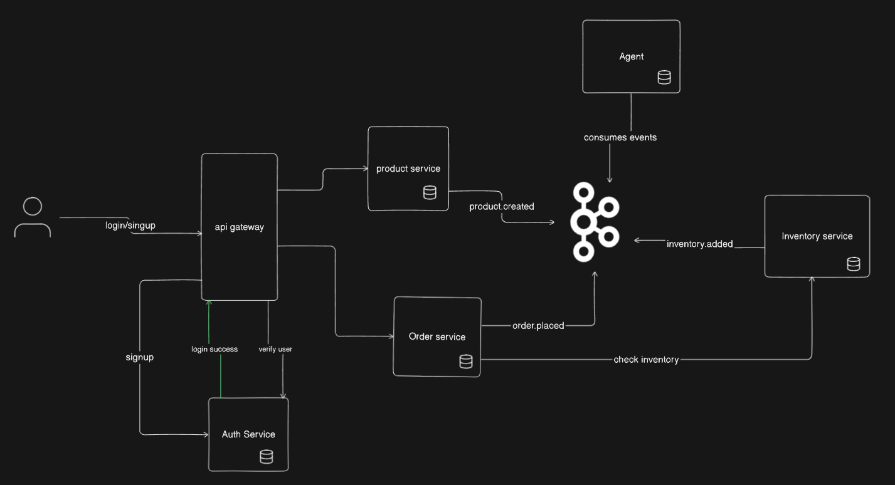

# Agent-Cart 🛒🤖

A **production-style, event-driven e-commerce backend** built with Java 21, Spring Boot 3, and Apache Kafka —
extended with an **AI-powered product search and recommendation engine** using Spring AI, RAG (Retrieval-Augmented Generation), and pgvector.

> "Built to production standards — every architectural decision reflects patterns used in real enterprise systems, with tradeoffs documented below."

---

## Table of Contents

- [Why This Architecture?](#why-this-architecture)
- [High-Level Design](#high-level-design)
- [Services Overview](#services-overview)
- [AI Agent Service — Deep Dive](#ai-agent-service--deep-dive)
- [Key Engineering Decisions & Tradeoffs](#key-engineering-decisions--tradeoffs)
- [Tech Stack](#tech-stack)
- [Testing Strategy](#testing-strategy)
- [CI/CD Pipeline](#cicd-pipeline)
- [How to Run](#how-to-run)
- [API Documentation](#api-documentation)

---

## Why This Architecture?

Most e-commerce tutorials show a monolith. I built this to answer a harder question:

> *"How do you design a system where services are independently deployable, failures are isolated, and data consistency is guaranteed — without distributed transactions?"*

Three core problems drove every architectural decision:

| Problem | Solution Chosen | Why |
|---|---|---|
| Services need to communicate without tight coupling | Kafka event streaming | Decouples producers from consumers; services can evolve independently |
| A service crash must not lose published events | Outbox Pattern | Guarantees atomicity between DB write and event publication without 2-phase commit |
| Users need intelligent product discovery, not just keyword search | RAG + Vector DB | Semantic similarity search understands intent, not just exact terms |

---

## High-Level Design



**Request flow:**
1. Client hits the **API Gateway** (single entry point, JWT-validated)
2. Gateway routes to the appropriate service via Eureka service discovery
3. Services communicate **asynchronously via Kafka** for state-changing events
4. The **Agent service** handles all AI queries — independently, without touching order/inventory logic

---

## Services Overview

| Service | Responsibility | Port |
|---|---|---|
| `service-registry` | Eureka — service discovery | 8761 |
| `cloud-config-server` | Centralized config management (GitHub-backed) | 8888 |
| `api-gateway` | Routing, JWT auth, circuit breaker | 8989 |
| `auth-service` | Signup/login, JWT issuance & validation | 9090 |
| `product-service` | Product catalog CRUD, emits `inventory.created` | 9091 |
| `inventory-service` | Stock management, consumes/produces inventory events | 9093 |
| `order-service` | Order placement, emits `order.placed`, handles saga compensation | 9094 |
| `agent` | AI-powered semantic search & chat using RAG + pgvector | — |

### Package Layout (Hexagonal Architecture)

```
<service-name>
└── src/main/java/com.tanveer.<service>
    ├── domain/          # Entities, value objects, domain services, domain events
    ├── application/     # Use cases (ports — inbound & outbound interfaces)
    └── infrastructure/
        ├── api/         # REST controllers (inbound adapter)
        ├── persistence/ # JPA repositories, entity mappers (outbound adapter)
        ├── messaging/   # Kafka producers, consumers, outbox scheduler
        └── config/      # Spring configuration beans
```

**Why Hexagonal?** The domain layer has zero dependencies on Spring, Kafka, or JPA. This means:
- Business logic can be unit-tested without spinning up any infrastructure
- The persistence layer can be swapped (e.g., PostgreSQL → MongoDB) without touching domain code
- Inbound adapters (REST, Kafka consumer) are interchangeable

---

## AI Agent Service — Deep Dive

The `agent` service is the most distinctive part of this project. It provides two capabilities:

### 1. Semantic Vector Search

**Endpoint:** `GET /api/v1/agent/search?query=give_me_the_AI_feature_phone_list`

Unlike a SQL `LIKE` query, this understands *intent*. A query for "AI feature phone" returns iPhones and Samsung FE — even if the product description never contains those exact words — because the vector embeddings capture semantic meaning.

**How it works:**

```
User Query
    │
    ▼
Embedding Model (Ollama) → Query Vector
    │
    ▼
pgvector similarity search (cosine distance)
    │
    ▼
Top-K most semantically similar product chunks
    │
    ▼
Return ranked results with distance scores
```

**Example Response:**
```json
[
  {
    "id": "0c1327c7-058b-4395-b687-89be684ca957",
    "text": "Product: IPhone 17 | MOB | AI feature phone by Apple | ¥124,000",
    "metadata": {
      "entity_type": "Inventory",
      "event": "inventory-adjust",
      "distance": 0.4828494
    }
  }
]
```

The `distance` score is the cosine distance from the query vector. Lower = more semantically similar.

---

### 2. Conversational AI (RAG Chat)

**Endpoint:** `POST /api/v1/agent/chat`

This implements full **Retrieval-Augmented Generation**:

```
User Prompt ("Give me best AI feature phone list")
    │
    ▼
Step 1 — RETRIEVE: Vector similarity search on pgvector
         → Fetch top-K relevant product chunks
    │
    ▼
Step 2 — AUGMENT: Inject retrieved products as context into the prompt
         → "Answer based only on the following products: [...]"
    │
    ▼
Step 3 — GENERATE: Ollama (Mistral model) generates grounded response
    │
    ▼
Response: Natural language answer, factually grounded in your product catalog
```

**Why RAG instead of fine-tuning?**

Fine-tuning an LLM on your product catalog is expensive, slow, and goes stale the moment your catalog changes. RAG gives you up-to-date, grounded answers because the retrieval step always hits the live vector store — no retraining needed.

**Why pgvector instead of a dedicated vector DB (Pinecone, Weaviate)?**

pgvector runs inside PostgreSQL — the same DB the inventory service already uses. For this scale, it avoids operational overhead of a separate service. In production with millions of products, a dedicated vector DB would be the right call.

---

### How Product Data Enters the Vector Store

The agent service is **event-driven** — it doesn't poll the product database. Instead:

1. `inventory-service` publishes `inventory-adjust` events to Kafka
2. `agent` consumes these events
3. Each inventory item is embedded (converted to a vector) and stored in pgvector

This means the AI knowledge base updates automatically whenever inventory changes — no manual sync needed.

---

## Key Engineering Decisions & Tradeoffs

### Outbox Pattern

**Problem:** When `order-service` places an order, it must write to its own DB *and* publish a Kafka event. If the service crashes between the DB write and the Kafka publish, the event is lost.

**Solution:** Write the event to an `outbox` table in the *same DB transaction* as the business data. A scheduled job then reads unpublished outbox entries and publishes them to Kafka, marking them as sent.

```
Order Placed
    │
    ▼
DB Transaction:
  ├── INSERT into orders table
  └── INSERT into outbox table (status=PENDING)
    │
    ▼
Outbox Scheduler (every N ms):
  └── SELECT * FROM outbox WHERE status=PENDING
      → publish to Kafka
      → UPDATE status=SENT
```
## Outbox Pattern flow


**Tradeoff:** Events may be published more than once (at-least-once delivery). Consumers handle this with an idempotency check — each processed event ID is stored; duplicates are discarded.

---

### Circuit Breaker (Resilience4j)

The API Gateway wraps each service route with a circuit breaker. If `order-service` is slow or down:
- After a threshold of failures, the circuit **opens** — requests fail fast instead of queuing
- A fallback endpoint returns a graceful degraded response
- After a timeout, the circuit goes **half-open** to probe recovery

This prevents one slow service from cascading failures across the entire system.

---

### Idempotent Kafka Producers

```yaml
producer:
  acks: all                          # All ISR replicas must acknowledge
  enable.idempotence: true           # Exactly-once semantics at producer level
  max.in.flight.requests.per.connection: 5
  retries: 2147483647                # Retry forever — Kafka handles dedup
```

`acks=all` + `enable.idempotence=true` guarantees that even if the producer retries on a timeout, Kafka deduplicates the message — so it's written exactly once to the log.

---

### Kafka Scalability Design

This system is designed to support **millions of events per day** through deliberate Kafka configuration:

```yaml
kafka:
  bootstrap-servers: localhost:9092
  producer:
    key-serializer: org.apache.kafka.common.serialization.StringSerializer
    value-serializer: org.apache.kafka.common.serialization.StringSerializer
    acks: all
    retries: 2147483647
    properties:
      enable.idempotence: true
      max.in.flight.requests.per.connection: 5
      compression.type: zstd       # Reduces network + disk I/O significantly
      linger.ms: 50                # Batches messages for 50ms before sending
      batch.size: 65536            # 64KB batch size for high throughput
  consumer:
    key-deserializer: org.apache.kafka.common.serialization.StringDeserializer
    value-deserializer: org.springframework.kafka.support.serializer.JsonDeserializer
  listener:
    ack-mode: manual_immediate     # Commit offset only after successful DB write
    enable-auto-commit: false      # Prevents data loss on consumer crash
    auto-offset-reset: earliest
    properties:
      max.poll.records: 500        # Process up to 500 records per poll cycle
```

**How this scales horizontally:**

| Practice | What it enables |
|---|---|
| **8+ partitions per topic** | Parallel consumption across multiple consumer instances |
| **Consumer groups per service** | Each service (`inventory-group`, `order-group`) scales independently |
| **Manual offset commit** | Offsets committed only after successful DB transaction — no data loss on crash |
| **Idempotent producers** | Safe retries without duplicate events in the log |
| **Processed-event dedup table** | Each consumer tracks processed event IDs — replayed messages are discarded |
| **Outbox → future Debezium CDC** | Outbox pattern can be replaced with Debezium for near-real-time, zero-polling delivery |

> To handle 1M+ order events: increase partitions, add consumer instances (Kafka rebalances automatically), scale brokers if needed.

---

## Tech Stack

| Layer | Technology |
|---|---|
| Language | Java 21 |
| Framework | Spring Boot 3, Spring Cloud 2025 |
| Service Discovery | Netflix Eureka |
| Config Management | Spring Cloud Config Server (GitHub-backed) |
| API Gateway | Spring Cloud Gateway (WebFlux) |
| Messaging | Apache Kafka |
| AI / ML | Spring AI, Ollama (Mistral), pgvector |
| Persistence | JPA/Hibernate, PostgreSQL (one DB per service) |
| Security | Spring Security, JWT |
| Resilience | Resilience4j (Circuit Breaker) |
| Testing | JUnit 5, Mockito, AssertJ |
| Containerization | Docker, Docker Compose |

---

## Testing Strategy

Tests follow the **test pyramid** — many fast unit tests at the base, fewer slower integration tests above.

| Layer | Tool | What's tested | Example |
|---|---|---|---|
| **Unit** | JUnit 5 + Mockito | Domain logic, use cases — no Spring context, no DB | Order rejection when stock insufficient |
| **Integration** | `@DataJpaTest` | JPA mappings, outbox writes, repository queries | Outbox entry persisted with `PENDING` status |
| **Slice** | `@WebMvcTest` | REST controllers — web layer only, services mocked | `POST /products` returns 201 with correct SKU |

**Key principle:** The domain layer has zero dependencies on Spring, Kafka, or JPA — so unit tests run in milliseconds with no infrastructure.

> Full test suite: [`src/test/`](./src/test/) — auth service has its own test module mirroring the production package structure.

---

### Service URLs

| Service | URL |
|---|---|
| Eureka Dashboard | http://localhost:8761 |
| Config Server | http://localhost:8888 |
| API Gateway | http://localhost:8989 |
| Auth Swagger | http://localhost:9090/swagger-ui/index.html |
| Product Swagger | http://localhost:9091/swagger-ui/index.html |
| Inventory Swagger | http://localhost:9093/swagger-ui/index.html |
| Order Swagger | http://localhost:9094/swagger-ui/index.html |

---

## API Documentation

All services expose interactive Swagger UI documentation. Full request/response examples are available at each service's `/swagger-ui/index.html`.

### Quick Reference

#### Auth
```
POST /api/v1/auth/signup    # Register user
POST /api/v1/auth/login     # Get JWT tokens
```

#### Products
```
POST   /api/v1/products         # Create product (triggers inventory.created event)
GET    /api/v1/products         # List all products
GET    /api/v1/products/{id}    # Get product by ID
```

#### Inventory
```
POST /api/v1/inventories/adjust/{sku}/{qty}    # Add stock
POST /api/v1/inventories/availability          # Check multi-SKU availability
```

#### Orders
```
POST /api/v1/orders    # Place order (triggers order saga)
GET  /api/v1/orders    # List orders
```

#### Agent (AI)
```
GET  /api/v1/agent/search?query=...    # Semantic vector search
POST /api/v1/agent/chat                # RAG-powered conversational search
```


